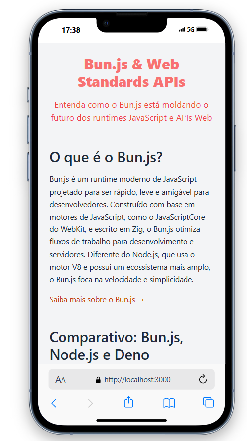
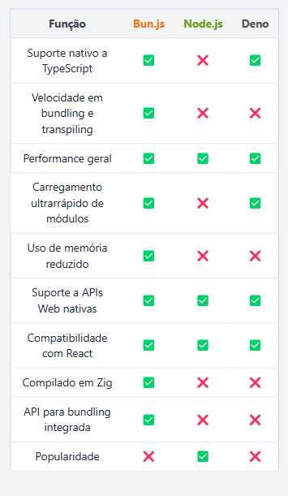

# **Bun.js & Web Standards APIs**

Este projeto explora o **Bun.js**, suas integrações com **Web Standards APIs**, e a forma como ele interage com **React** para desenvolvimento rápido e moderno. Inclui um comparativo entre os runtimes JavaScript mais populares: **Bun.js**, **Node.js** e **Deno**, além de destacar as tecnologias utilizadas no projeto.

---

## **Descrição**

A aplicação busca demonstrar como o **Bun.js** pode moldar o futuro dos runtimes JavaScript e facilitar o desenvolvimento de aplicações modernas. O projeto conta com:

- Uma explicação detalhada do **Bun.js** e sua integração com **Web Standards APIs**.
- Um comparativo interativo entre **Bun.js**, **Node.js** e **Deno**.
- Integração visual com **React** e estilização com **Tailwind CSS**.
- Utilização de templates com **Mustache**.

---

## **Tecnologias Utilizadas**

## **Tecnologias Utilizadas**

| <br>**React**<br>Biblioteca para construção de interfaces de usuário. | <br>**Bun.js**<br>Runtime de JavaScript ultrarrápido, escrito em Zig. |
|:-----------------------------------------------------------------------------------------------------------:|:-----------------------------------------------------------------------------------------------------------:|
| <br>**TypeScript**<br>Superset de JavaScript que adiciona tipagem estática. | <br>**Tailwind CSS**<br>Framework utilitário para estilização rápida e responsiva. |
| <br>**Mustache**<br>Motor de template simples e flexível. |  

---

## **Imagens do Projeto**

### **Tela Principal**


### **Tela de Comparativos**


---

## **Como Rodar o Projeto**

1. **Instale o Bun.js**  
   [Guia de instalação oficial](https://bun.sh/)

2. **Clone o repositório**
   ```bash
   git clone https://github.com/WesleyBSa/BunReact-Information.git
   cd bun
   ```

3. **Instale as dependências**
   ```bash
   bun install
   ```

4. **Rode o projeto**
   ```bash
   bun run server.ts
   ```

5. Acesse no navegador: `http://localhost:3000`.

---

## **Referências**

- [API blog com Bun](https://github.com/WesleyBSa/bun-blogApi)  
Repositório com informações detalhadas sobre o Bun.js.

---

## **Autor**

Criado e mantido por [Wesley B. Santana](https://www.linkedin.com/in/wesley-batista-74b7a1198/).  

